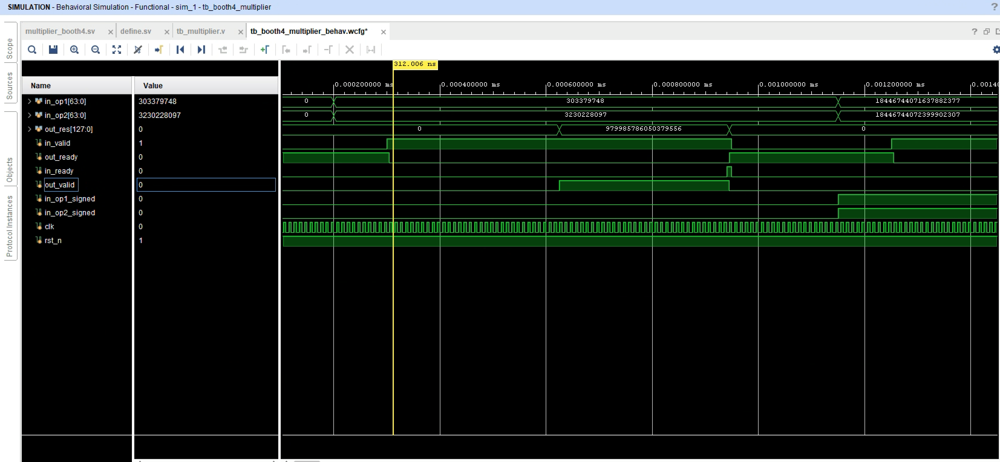
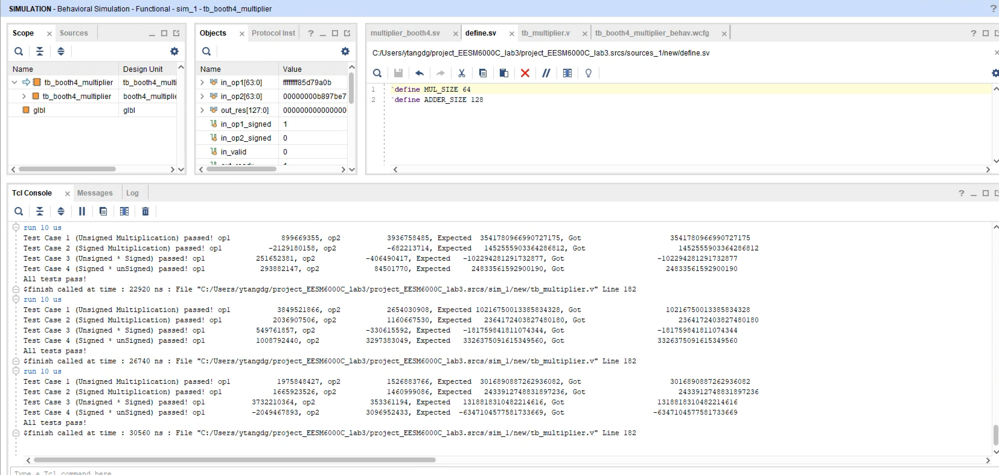

This is a booth4 based multiplier.

It takes half width number's cycles to get the output.

You can set the width of multiplier and adder (it instantiates a adder inside) in "define.sv". You should notice that you can set the MUL_WIDTH to be 4, 16, 32, 64, 128, 256 .... (2 ^ n) but you must make sure the ADDER_WIDTH = 2 * MUL_WIDTH, unless it won't work.

