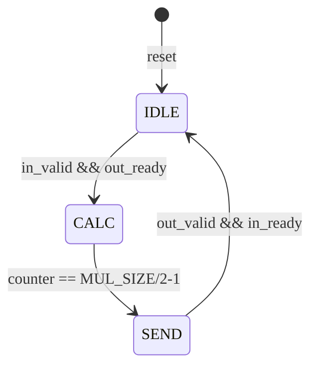

# Booth Radix-4 Multiplier 
Configurable Radix-4 Booth multiplier implementing with Brent-Kung adder. Supports 2 ^ n bit-widths (4/16/32/64...).

## Key Features
• **Parameterized Design**: Customizable `MUL_SIZE` (4/16/32/64/128...)
• **Dual-mode Operation**: Supports both signed (Two's complement) & unsigned numbers

## Implementation
### FSM Workflow

## Verification
Following bit-widths have been verified : 8, 16, 32, 64.

## Contribution
Contributions to this project are highly encouraged and appreciated! Whether it's debug related, feature enhancements, or optimizations, your contributions can help improve the overall quality and functionality.