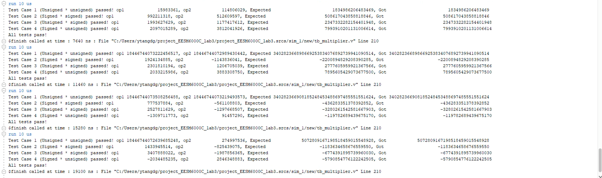

# Booth4 Based Wallace Multiplier
## Basic Function
This is a Booth4 Based Wallace multiplier. It has two stage pipelines inside to increase max frequency. It will generate an output each clk cycle and the output valid signal shows whether the result is valid. The data width of the multiplier has been set as a parameter, and you can modify it to be 8, 16, 32, 64, 128, 256, .... **(2 ^ n)**. Please kindly know that the minimum width is 8 and you should keep the ADDER_SIZE to be 2 * MUL_SIZE also.

### Essential Files
"booth4wallace_multiplier_nbit.sv" is the top module.

"Brent_Kung_Adder_nbit.sv" and "pg_unit.sv" as adder dependency.

"booth4_op_generator" is for generating operands according to booth code.

"onebit_adder.sv", "op_3_to_2_nbit", "op_n_to_2_nbit_onestage", and "op_n_to_2_nbit" are for buiding wallace tree. "op_n_to_2_nbit" can turn any number (set as parameter OP_WIDTH) same width bits into two operands. But you should notice that the input width and output width are same, which means it can not deal with overflow. Therefore the parameter OP_WIDTH should be high enough to make sure the output will not have any overflow.

### Handshake Signal
This multiplier includes a state machine (IDLE state, CALCULATION state, and SEND state) and uses a handshake signal to control the change of state.

**in_valid:** It comes from the source model. The multiplier won't begin to calculate unless in_valid is 1.

**out_ready:** It is an output of the multiplier. It shows whether the multiplier is ready to get the data. It will be 0 if the multiplier is still calculating or the result hasn't been received by the destination module.

**in_ready:** It comes from the destination module. When the calculation has finished, the multiplier will keep the result unless the destination module has received it. Please kindly note that the multiplier won't begin a new round of calculation unless the destination module has received the result (in_ready is 1).

**out_valid:** It is an output of the multiplier. It shows whether the result is valid. It will be set as 1 only when the calculation has finished.

### Signed and Unsigned Calculation
Please kindly know that the input data should be complementary. You should also set the value of __in_op1_signed__ and __in_op2_signed__ to indicate whether the operand 1 or operand 2 is signed or unsigned. This is important because it will affect the sign bit extension in the code.

## Simulation Result
**WAVE VIEW**

The simulation tool is Vivado 2023.1. Here we show the process of one round calculation. In this case, we set the __MUL_SIZE__ to be 64 bits, which means it takes 32 clock cycles to calculate.

The red circle indicates the time state machine enters the CALCULATION state from the IDLE state. The blue circle indicates the calculation has finished and the SEND state. The pink circle indicates the result has been received and goes back to the IDLE state.

**TEST RESULT**

The following figure shows some of the tests used to judge whether the result is correct.

## Contribution
Contributions to this project are highly encouraged and appreciated! Whether it's bug fixes, feature enhancements, or optimizations, your contributions can help improve the overall quality and functionality of the multiplier.