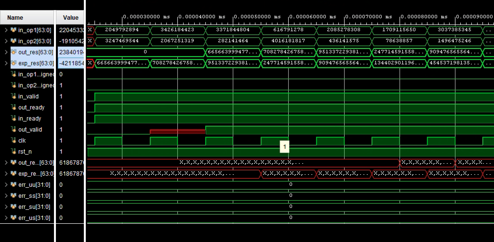
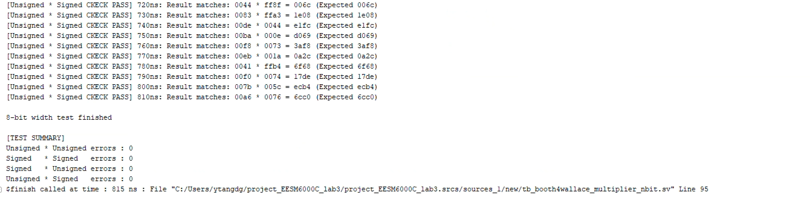
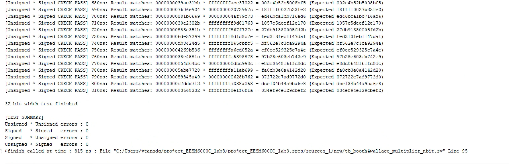
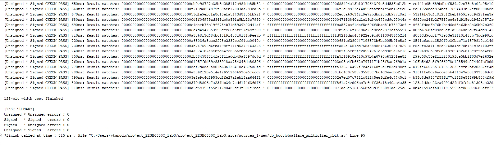

# Booth Radix4 Based Wallace Multiplier
## Operation Flow
The multiplier utilizes Booth's Radix-4 algorithm and Wallace tree compression for efficient partial product accumulation. Here's the step-by-step workflow:

1. **Booth4 Encoding**:  
   The `booth4_op_generator` module encodes the multiplier operand using Radix-4 Booth algorithm, generating partial products with proper sign extension based on `in_op1_signed` and `in_op2_signed` signals.

2. **Wallace Tree Compression**:  
   The generated partial products are compressed into two operands using a multi-stage Wallace tree structure implemented in `op_n_to_2_nbit` modules. This reduces the number of operands through 3:2 or higher compression stages.

3. **Final Addition**:  
   The compressed operands are summed using a Brent-Kung prefix adder (`Brent_Kung_Adder_nbit`) to produce the final multiplication result.

4. **Pipeline Control**:  
   The design features a two-stage pipeline:

   • **Stage 1**: Partial product generation and initial compression.

   • **Stage 2**: Final adder computation and result output.  

   The pipeline requires 2 cycles for initial latency and produces one result per cycle thereafter.

### Handshake Protocol
The multiplier implements a ready-valid handshake for flow control:

• **in_valid**: Indicates valid input data (from source). The multiplier processes data regardless but uses this signal to validate results.

• **out_valid**: Asserted 2 cycles after `in_valid`, marking valid output data.

• **in_ready**: Indicates downstream readiness (from destination). Stalls the pipeline when low.

• **out_ready**: Asserted when the multiplier can accept new inputs. De-asserts during pipeline stalls.

## File Hierarchy
The design hierarchy is structured as follows:

```
booth4wallace_multiplier_nbit.sv
  ├── booth4_op_generator.sv
  │     └── op_n_to_2_nbit.sv
  │           └── op_n_to_2_nbit_onestage.sv
  │                 └── op_3_to_2_nbit.sv
  │                       └── onebit_adder.sv
  ├── Brent_Kung_Adder_nbit.sv
  │     └── pg_unit.sv
  └── op_n_to_2_nbit.sv
```
## Key Modules
• **`booth4_op_generator.sv`**: Implements Booth Radix-4 encoding with configurable sign handling.

• **`op_n_to_2_nbit.sv`**: Configurable Wallace tree compressor supporting arbitrary operand reduction (parameter `OP_NUM`, `OP_WIDTH`).

• **`Brent_Kung_Adder_nbit.sv`**: Low-latency adder for final addtion.

## Simulation Verification
### Waveform
Following figure shows part of the waveform of 32-bit multiplier. It has 2-cycle initial delay to generate output.



### Test Coverage
• Verified widths: 8, 32, 64, 128 bits

  
  
  
  

## Scalability Notes
  • Supported widths: Ideally ant width

## Contribution
Contributions to this project are highly encouraged and appreciated! Whether it's debug related, feature enhancements, or optimizations, your contributions can help improve the overall quality and functionality.