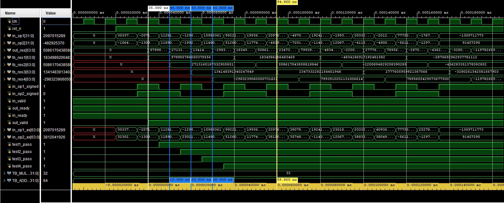
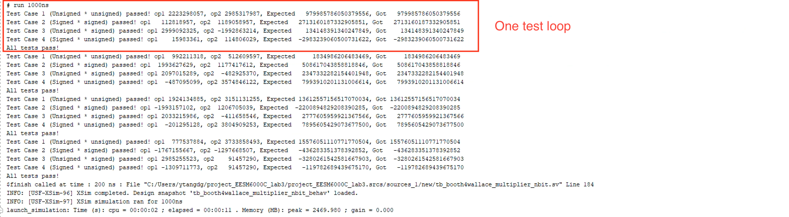
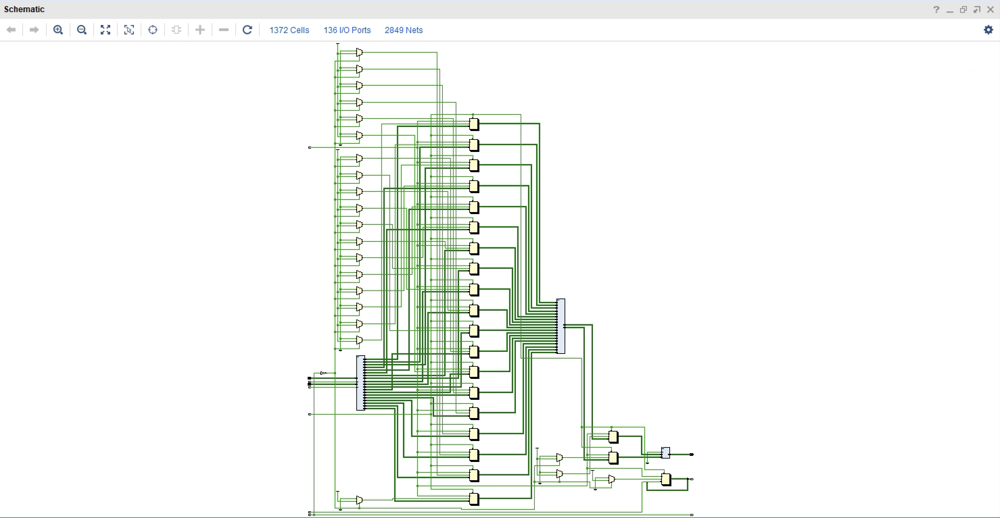

# Booth4 Based Wallace Multiplier
## Basic Function
This is a Booth4-based Wallace multiplier. It has two-stage pipelines inside to increase max frequency. It needs 2 cycles to start and will generate an output each clock cycle after that. The output valid signal shows whether the result is valid. The data width of the multiplier has been set as a parameter, and you can modify it to be 8, 16, 32, 64, 128, 256, .... **(2 ^ n)**. Please kindly note that the minimum width is 8 and you should keep the ADDER_SIZE to be 2 * MUL_SIZE also.

### Essential Files

**"booth4wallace_multiplier_nbit.sv"** is the top module.

**"Brent_Kung_Adder_nbit.sv"** and **"pg_unit.sv"** are adder dependencies.

**"booth4_op_generator.sv"** is for generating operands according to Booth code.

**"onebit_adder.sv"**, **"op_3_to_2_nbit.sv"**, **"op_n_to_2_nbit_onestage.sv"**, and **"op_n_to_2_nbit.sv"** are for building Wallace tree. **"op_n_to_2_nbit.sv"** can turn any number (set as a parameter OP_WIDTH) of the same width bits into two operands. But you should notice that the input width and output width are the same, which means it cannot deal with overflow. Therefore, the parameter OP_WIDTH should be high enough to make sure the output will not have any overflow.

### Handshake Signal

**in_valid:** It comes from the source model, showing whether the data is valid. However, no matter whether the data is valid, the multiplier will calculate it.

**out_ready:** It is an output of the multiplier. It shows whether the multiplier is ready to get the data. It will be 0 when the pipeline stalls.

**in_ready:** It comes from the destination module. The pipeline will stall unless this signal is 1.

**out_valid:** It is an output of the multiplier. It shows whether the result is valid. It is just the assigned value by the in_valid with a 2-cycle delay to synchronize with the results.

### Signed and Unsigned Calculation
Please kindly know that the input data should be complementary. You should also set the value of __in_op1_signed__ and __in_op2_signed__ to indicate whether operand 1 or operand 2 is signed or unsigned. This is important because it will affect the sign bit extension in the code.

## Simulation Result
**WAVE VIEW**

The simulation tool is Vivado 2023.1. Here we show the process of one round calculation. In this case, we set the __MUL_SIZE__ to be 32 bits.

Please notice that, because of my bad testbench skill, each 4 results is a test loop, for example, the out_res at 35, 45, 55, and 65 ns are from one loop including unsigned * unsigned, signed * signed, unsigned * signed, and signed * unsigned. Meanwhile, the results are corresponded to tb_res1, tb_res2, tb_res3, and tb_res4 respectively.

**TEST RESULT**

The following figure shows some of the tests used to judge whether the result is correct.

**SCHEMATIC**
The follwing figure shows the 8 bit and 32 bit schematic

## Contribution
Contributions to this project are highly encouraged and appreciated! Whether it's bug fixes, feature enhancements, or optimizations, your contributions can help improve the overall quality and functionality of the multiplier.