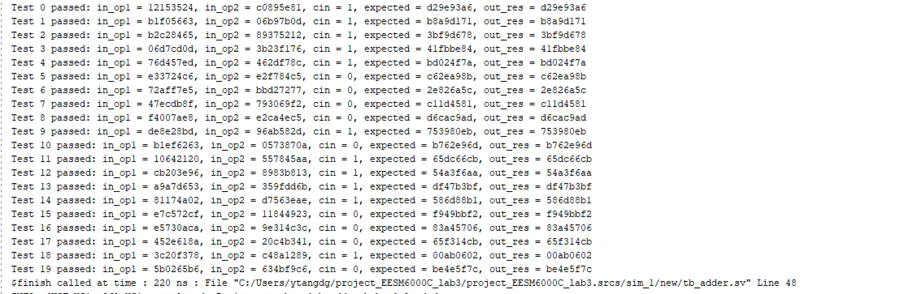

# Brent-Kung Adder
## Basic Function
This is a brent kung adder. You can set the ADDER_SIZE parameter as any bits of **(2 ^ n)** (4, 8,16 , 32, 64, 128 ....).

### Essential Files
"Brent_Kung_Adder_nbit.sv" is the top module. You need "pg_unit.sv" as dependency.

## Simulation Result
**WAVE VIEW**

The simulation tool is Vivado 2023.1. Here we show the process of one round calculation. In this case, we set the __MUL_SIZE__ to be 64 bits, which means it takes 32 clock cycles to calculate.

The red circle indicates the time state machine enters the CALCULATION state from the IDLE state. The blue circle indicates the calculation has finished and the SEND state. The pink circle indicates the result has been received and goes back to the IDLE state.

**TEST RESULT**

The following figure shows some of the tests used to judge whether the result is correct.

## Synthesis Result

Here shows the schematic of this kind of adder with setting ADDER_SIZE to be 32, 64, 128 bit. 

**32 Bit**

For 32 bits, it shows that we use 57 (number of cells - 12) gp_units in total and is equal to original algorithm's value.

(16 + 8 + 4 + 2 + 1 + 1 + 3 + 7 + 15 = 57).

**64 Bit**

For 64 bits, it shows that we use 120 gp_units in total and is equal to original algorithm's value.

(32 + 16 + 8 + 4 + 2 + 1 + 1 + 3 + 7 + 15 + 31 = 120).

**128 Bit**

For 128 bits, it shows that we use 247 gp_units in total and is equal to original algorithm's value.

(64 + 32 + 16 + 8 + 4 + 2 + 1 + 1 + 3 + 7 + 15 + 31 + 63= 247).

## Contribution
Contributions to this project are highly encouraged and appreciated! Whether it's bug fixes, feature enhancements, or optimizations, your contributions can help improve the overall quality and functionality of the adder.