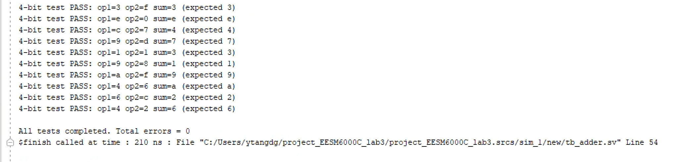
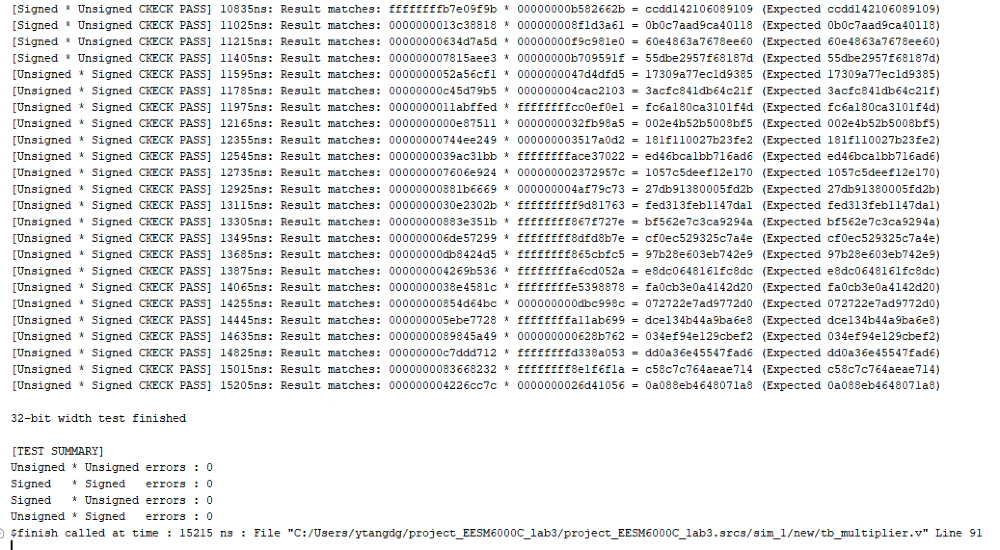

# Brent-Kung Adder
This is a Brent-Kung adder with configurable bit-width. It Supports any `2^n` bit-width (4/8/16/32/64/128...). You can adjust `ADDER_SIZE` to get the different-width adder you want.

## Simulation Results
Following bit width have been verified: 4 bits, 16bits, 32bits and 128bits.

## Synthesis Results
### Resource Utilization
| Bit-width | Logic Cells |
|-----------|-------------|
| 32-bit    | 57 PG Units |
| 64-bit    | 120 PG Units|
| 128-bit   | 247 PG Units|

### Schematic

  
  
  

## Contribution
Contributions to this project are highly encouraged and appreciated! Whether it's debug related, feature enhancements, or optimizations, your contributions can help improve the overall quality and functionality.
