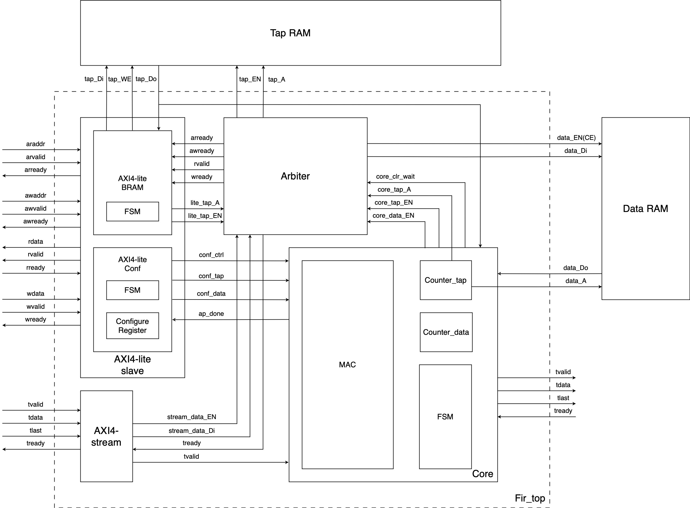
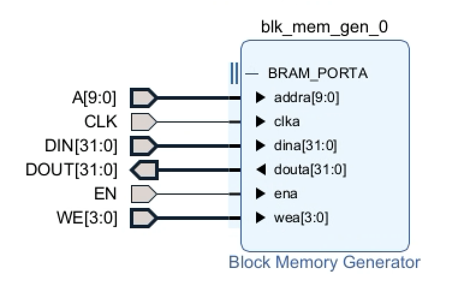

# Fir
## How It Works
### Basic Using Steps
Here we will briefly explain the basic idea of how it operates. The details will be shown in the following sections. The diagram below illustrates the structure of the design.



In this design, you can access three components via the AXI4-Lite and AXI4-Stream slave interfaces: **Tap RAM**, **Data RAM**, and **Configure Register**.

1. **Write Taps**:  
   First, write all your filter coefficients (taps) to the **Tap RAM** (the maximum number of taps supported is 1023).

2. **Configure Parameters**:  
   Set the number of taps (filter length) and the number of input data points in the **Configure Register**.

3. **Prepare Data Input**:  
   Prepare your input data and ensure that each new data is sent to the module via the AXI4-Stream interface (`ss_tdata` signal) when ready.

4. **Start Calculation**:  
   Write a start command to the **Configure Register** to initiate the FIR computation. The results will be output through the AXI4-Stream master interface.

### Address Map
This section explains how to access each component.

#### Access Tap RAM
• **Interface**: AXI4-Lite  
• **Address Range**: `32'h3xxx_xxxx` (upper 4 bits = `0011`)  
• **Address Usage**: The lower 10 bits are used as the RAM address.  
• **Note**: Taps must be written consecutively starting from `32'h3000_0000` (each address plus 1).

#### Access Configure Register
• **Interface**: AXI4-Lite  
• Contains three registers:
  1. **Ctrl Register** (`32'h0xxx_xxxx`):

       ◦ `ap_start` (bit 0): Write `1` to start computation.

       ◦ `ap_done` (bit 1): Indicates completion (read-only).

       ◦ `ap_idle` (bit 2): Indicates idle state (read-only).

  2. **Tap Register** (`32'h1xxx_xxxx`): Specifies the number of taps (10-bit value).

  3. **Data Register** (`32'h2xxx_xxxx`): Specifies the number of input data points (10-bit value).

#### Access Data RAM
• **Interface**: AXI4-Stream  
• **Note**: Data is written dynamically during computation. Do not preload Data RAM, just make sure new data is there when tready is asserted.

## File Hierarchy
The design hierarchy is as follows:

```
fir_top.sv
  ├── fir_core.sv
  │     ├── booth4wallace_multiplier_nbit.sv
  │     │     ├── booth4_op_generator.sv
  │     │     │     └── op_n_to_2_nbit.sv
  │     │     │           └── op_n_to_2_nbit_onestage.sv
  │     │     │                 └── op_3_to_2_nbit.sv
  │     │     │                       └── onebit_adder.sv
  │     │     └── brent_kung_adder_nbit.sv
  │     │           └── pg_unit.sv
  │     └── brent_kung_adder_nbit.sv
  │           └── pg_unit.sv
  ├── axi4_lite_slave.sv
  │     ├── axi4_lite_slave_bram.sv
  │     └── axi4_lite_slave_conf.sv
  ├── axi4_stream_slave_bram.sv
  └── bram_access_arbiter.sv
```

### Key Files
• **`fir_top.sv`**: Top-level module with AXI4 interfaces.
• **`fir_core.sv`**: FIR computation core using Booth-Wallace multiplier and Brent-Kung adder.
• **`axi4_lite_slave.sv`**: AXI4-Lite interface handlers for registers and Tap RAM.
• **`axi4_stream_slave_bram.sv`**: AXI4-Stream interface for Data RAM.
• **`bram_access_arbiter.sv`**: Arbitration logic for RAM access.

## IP Configuration

• **Tap RAM**: Standard BRAM (1024-depth, no output registers).  
• **Data RAM**: RAM-based shifter (1024-depth, no output registers).  

<div style="display: flex; gap: 10px; width: 100%;">
  
  
</div>

## Simulation Results
The verification used 600 input data points. The final checks (points 2 and 4) validated the control register with masking. Despite `rdata` being `3'b110`, masking yielded `3'b010` and `3'b100`, confirming correct operation.


## Notes
### **Scalability**:  
• `pDATA_WIDTH` can be `8, 16, 32, 64, 128...` (powers of 2, ≥8).  
• `TAP_NUM_WIDTH` and `DATA_NUM_WIDTH` must match the RAM depth.  
• **Output Bits**: By default, the lower 32 bits are output. Modify `fir_top.sv` to access higher-order bits.  
• **Status**: Core functionality is verified. Ongoing optimizations and detailed validations are in progress.